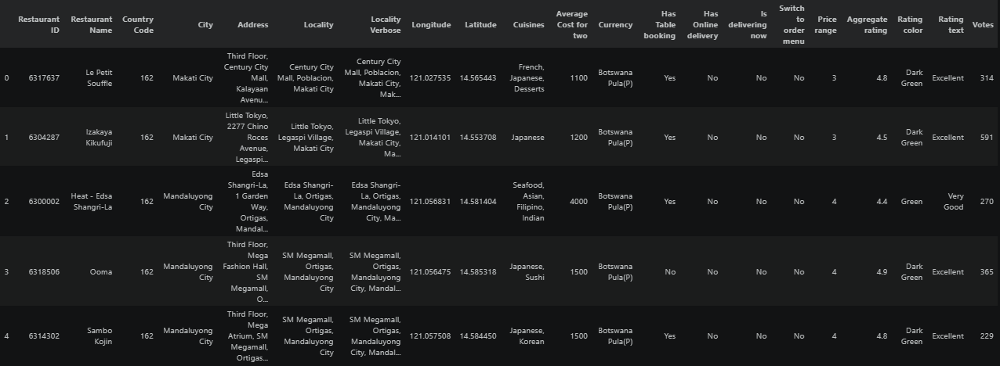
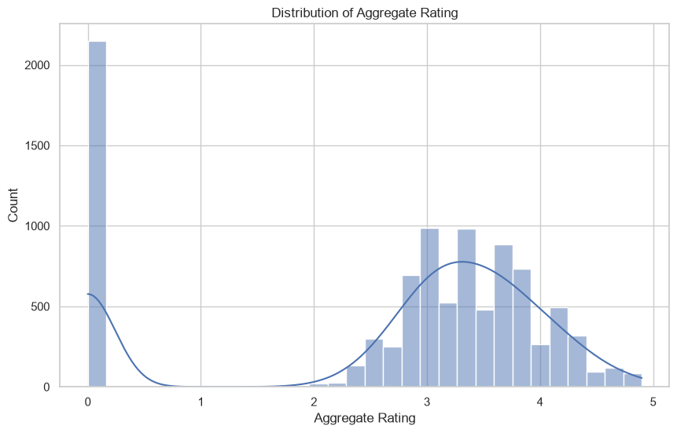
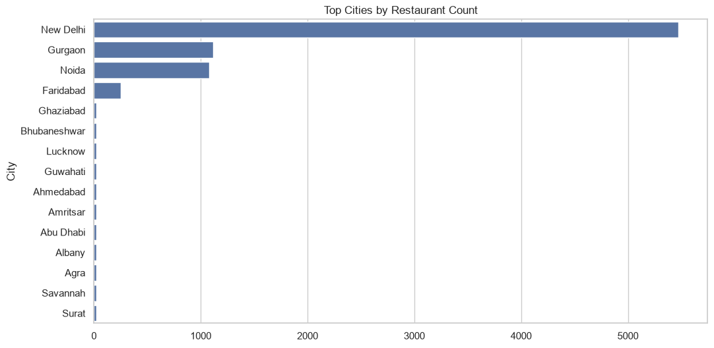
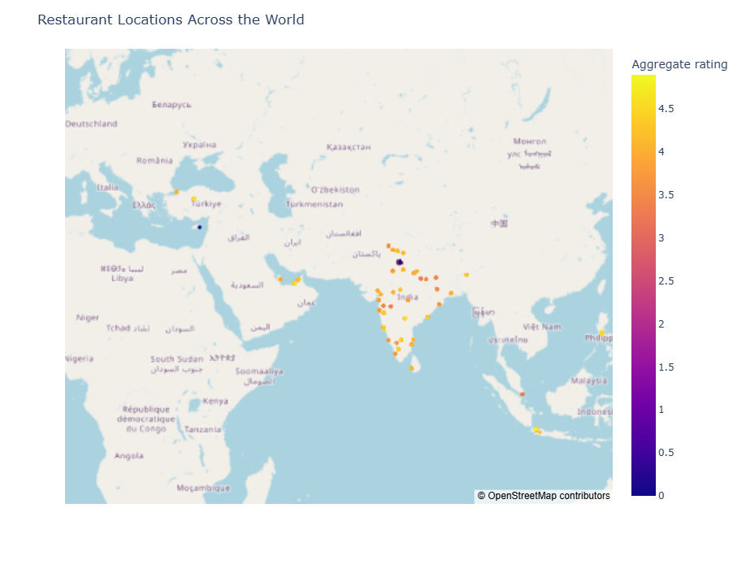

# Level 1 - Data Exploration & Exploratory Data Analysis (EDA)


---

## Project Overview

This project represents **Level 1** of the **Cognifyz Technologies Data Science Internship Program**.

The primary objective of this level is to understand the restaurant dataset through **Exploratory Data Analysis (EDA)**. Before building predictive models or performing advanced analytics, it is essential to explore the dataset, understand its structure, identify missing values, analyze feature distributions, and uncover meaningful business insights.

Using Python and its powerful data analysis libraries, this project performs data preprocessing, descriptive statistical analysis, and geospatial visualization to gain a comprehensive understanding of restaurant characteristics, customer ratings, pricing, cuisines, and geographic distribution.

The analysis establishes a strong foundation for the advanced business analysis and machine learning tasks completed in the subsequent internship levels.

---

# Objectives

The main objectives of this project are to:

- Explore the structure of the restaurant dataset.
- Understand the dimensions and features of the dataset.
- Identify and handle missing values.
- Examine data types and overall data quality.
- Analyze the distribution of restaurant ratings.
- Perform descriptive statistical analysis.
- Identify popular cities and cuisines.
- Study restaurant price distribution.
- Perform geospatial analysis using latitude and longitude.
- Visualize important business insights through professional charts and graphs.
- Prepare the dataset for future business analysis and machine learning tasks.

---

# Dataset Information

The project uses the **Zomato Restaurant Dataset**, which contains information about restaurants from multiple cities around the world.

The dataset includes restaurant details such as:

- Restaurant Name
- Country Code
- City
- Address
- Locality
- Latitude
- Longitude
- Cuisines
- Average Cost for Two
- Currency
- Has Table Booking
- Has Online Delivery
- Is Delivering Now
- Switch to Order Menu
- Price Range
- Aggregate Rating
- Rating Color
- Rating Text
- Votes

This dataset provides valuable information for performing exploratory data analysis, understanding customer preferences, and discovering business insights within the restaurant industry.

---

# Project Structure

```text
DataScience-Level1-DataExploration/
│
├── Dataset.csv
├── Level_1_Data_Exploration.ipynb
└── README.md
```

### Repository Contents

| File | Description |
|------|-------------|
| `Level_1_Data_Exploration.ipynb` | Complete Level 1 notebook containing exploratory data analysis and geospatial analysis. |
| `Dataset.csv` | Restaurant dataset used throughout the project. |
| `README.md` | Project documentation, workflow, and analysis summary. |

---

# Technologies Used

The project was developed using the following technologies:

- Python 3
- Visual Studio Code
- Jupyter Notebook
- Git
- GitHub

---

# Python Libraries Used

The following libraries were used during the analysis:

| Library | Purpose |
|---------|---------|
| Pandas | Data loading, cleaning, manipulation, and analysis |
| NumPy | Numerical computing and mathematical operations |
| Matplotlib | Data visualization and plotting |
| Seaborn | Statistical data visualization |
| Plotly *(optional)* | Interactive visualizations (if used) |

---

# Development Environment

- **IDE:** Visual Studio Code
- **Notebook Environment:** Jupyter Notebook
- **Programming Language:** Python
- **Version Control:** Git & GitHub

---

# Skills Demonstrated

This project demonstrates practical knowledge of:

- Exploratory Data Analysis (EDA)
- Data Cleaning
- Data Understanding
- Descriptive Statistics
- Business Insight Generation
- Geospatial Data Analysis
- Data Visualization
- Python Programming
- Data Interpretation

---

# Project Workflow

The Level 1 workflow follows a structured Exploratory Data Analysis (EDA) pipeline to understand the restaurant dataset before performing advanced business analysis and predictive modeling.

The workflow includes:

```text
Dataset Collection
        │
        ▼
Data Loading
        │
        ▼
Dataset Exploration
        │
        ▼
Data Cleaning
        │
        ▼
Missing Value Analysis
        │
        ▼
Statistical Analysis
        │
        ▼
Restaurant Analysis
        │
        ▼
Geospatial Analysis
        │
        ▼
Business Insights
        │
        ▼
Conclusion
```

This systematic workflow ensures that the dataset is well understood before moving towards advanced analytics and machine learning tasks.

---

# Step 1 – Importing Required Libraries

The analysis begins by importing the essential Python libraries required for data manipulation, visualization, and exploratory data analysis.

The primary libraries include:

- **Pandas** – Data loading and manipulation
- **NumPy** – Numerical computations
- **Matplotlib** – Data visualization
- **Seaborn** – Statistical visualization

These libraries provide an efficient environment for working with structured datasets and generating meaningful visual insights.

---

# Step 2 – Dataset Loading

The restaurant dataset is loaded into a Pandas DataFrame using the `read_csv()` function.

After loading, the dataset is inspected to verify that all records and columns have been imported correctly.

The first few records are displayed to obtain an initial understanding of the available information.

---

# Step 3 – Dataset Exploration

A preliminary exploration of the dataset is performed to understand its overall structure.

The following aspects are examined:

- Number of rows and columns
- Column names
- Data types
- Sample records
- General dataset information

Understanding these characteristics helps identify potential issues before performing detailed analysis.

---

# Step 4 – Data Quality Assessment

Before beginning the analysis, the overall quality of the dataset is evaluated.

The assessment focuses on:

- Missing values
- Duplicate records
- Incorrect data types
- Inconsistent values
- Overall completeness of the dataset

Ensuring good data quality improves the reliability of all subsequent analyses and visualizations.

---

# Step 5 – Descriptive Statistical Analysis

Descriptive statistics are generated to summarize the numerical features within the dataset.

Key statistical measures include:

- Count
- Mean
- Standard Deviation
- Minimum
- Maximum
- Quartiles (25%, 50%, and 75%)

These statistics provide a quick overview of the distribution and variability of important restaurant attributes.

---

# Step 6 – Feature Understanding

Each feature in the dataset is carefully examined to understand its significance.

Examples include:

- Restaurant information
- Geographic location
- Customer ratings
- Pricing details
- Cuisine types
- Customer voting patterns
- Online delivery availability
- Table booking availability

A clear understanding of these features forms the foundation for generating meaningful business insights.

---

# Exploratory Analysis Summary

At the completion of the initial exploration stage, the following objectives have been achieved:

- Successfully loaded the dataset.
- Verified the dataset structure and integrity.
- Explored important variables and their data types.
- Evaluated overall data quality.
- Performed descriptive statistical analysis.
- Prepared the dataset for visual exploration and business insight generation.

These steps establish a strong foundation for the remaining analyses performed in this project.

---

# Exploratory Data Analysis (EDA)

After understanding the dataset structure and validating its quality, exploratory data analysis was performed to identify meaningful patterns, relationships, and business insights hidden within the restaurant dataset.

The analysis focused on customer ratings, restaurant locations, cuisines, pricing, and geographical distribution.

---

# Aggregate Rating Analysis

The **Aggregate Rating** represents the overall customer satisfaction score for each restaurant.

The rating distribution was analyzed to understand how restaurants perform across different rating categories.

### Analysis Performed

- Examined the distribution of aggregate ratings.
- Identified restaurants with zero ratings.
- Observed the concentration of restaurants across different rating ranges.
- Compared rating frequencies using graphical visualization.

### Key Observations

- Most restaurants received ratings between **3.0 and 4.5**, indicating generally positive customer feedback.
- A noticeable number of restaurants had **0 ratings**, suggesting either newly listed restaurants or restaurants with insufficient customer reviews.
- Very few restaurants achieved ratings close to **5.0**, indicating that exceptionally high-rated restaurants are relatively uncommon.

---

# City-wise Restaurant Analysis

Restaurant distribution was analyzed across different cities to understand where restaurants are most concentrated.

### Analysis Performed

- Counted restaurants available in each city.
- Identified cities with the highest restaurant density.
- Compared restaurant counts using bar charts.

### Key Observations

- Restaurant distribution is uneven across cities.
- Certain metropolitan cities contain a significantly larger number of restaurants.
- Larger cities provide richer datasets for further business analysis.

---

# Cuisine Analysis

Cuisine information provides valuable insight into customer food preferences.

### Analysis Performed

- Identified the most frequently occurring cuisines.
- Compared cuisine popularity.
- Examined cuisine diversity across restaurants.

### Key Observations

- Some cuisines dominate the dataset.
- Restaurants often serve multiple cuisines.
- Cuisine diversity reflects varying customer preferences and regional food culture.

---

# Price Range Analysis

Restaurant pricing was analyzed to understand customer affordability and market segmentation.

### Analysis Performed

- Distribution of restaurants across different price ranges.
- Comparison of price categories.
- Visualization using count plots.

### Key Observations

- Most restaurants belong to lower and mid-price categories.
- Premium restaurants represent a smaller proportion of the dataset.
- The pricing distribution indicates strong competition in affordable restaurant segments.

---

# Geospatial Analysis

Geographical analysis was performed using restaurant latitude and longitude coordinates.

The objective was to understand how restaurants are geographically distributed.

### Analysis Performed

- Examined latitude and longitude information.
- Visualized restaurant locations.
- Explored spatial distribution patterns.

### Key Observations

- Restaurants are spread across multiple geographical regions.
- Restaurant density varies considerably between locations.
- Geographic coordinates enable spatial visualization and location-based business analysis.

---

# Data Visualizations

Several visualizations were created to better understand the dataset and communicate important findings.

The visualizations include:

- Aggregate Rating Distribution
- Restaurant Count by City
- Cuisine Distribution
- Price Range Distribution
- Geospatial Restaurant Distribution

These visualizations simplify complex information and make business insights easier to interpret.

---

# Project Screenshots

### Dataset Preview

The initial rows of the dataset provide an overview of the available restaurant information and feature structure.

<p align="center">
  
</p>

---

### Aggregate Rating Distribution

Visualization showing the distribution of restaurant ratings across the dataset.

<p align="center">
  
</p>

---

### Top Cities Analysis

Distribution of restaurants across the most represented cities.

<p align="center">
  
</p>

---

### Geospatial Analysis

Visualization illustrating the geographical distribution of restaurants using latitude and longitude.

<p align="center">
  
</p>

---

# Business Insights

The exploratory analysis revealed several valuable insights:

- Customer ratings are generally positive across the dataset.
- Restaurant availability is concentrated in selected cities.
- Affordable restaurants dominate the market.
- Cuisine diversity plays an important role in customer preferences.
- Geographic information enables location-based analysis and visualization.
- Exploratory analysis provides the foundation for advanced business analytics and predictive modeling in later project levels.

---

# Summary of Level 1 Analysis

During this level, the following tasks were successfully completed:

- Dataset Loading
- Dataset Exploration
- Data Quality Assessment
- Missing Value Analysis
- Descriptive Statistical Analysis
- Aggregate Rating Analysis
- City-wise Restaurant Analysis
- Cuisine Analysis
- Price Range Analysis
- Geospatial Analysis
- Business Insight Generation

---
---

# How to Run the Project

Follow these steps to execute this project on your local machine.

## 1. Clone the Repository

```bash
git clone https://github.com/your-username/Cognifyz-DataScience-Projects.git
```

## 2. Navigate to the Project Folder

```bash
cd Cognifyz-DataScience-Projects/DataScience-Level1-DataExploration
```

## 3. Install Required Libraries

```bash
pip install pandas numpy matplotlib seaborn plotly jupyter
```

## 4. Launch Jupyter Notebook

```bash
jupyter notebook
```

Open:

```
Level_1_Data_Exploration.ipynb
```

and execute the notebook from top to bottom.

---

# Project Outcomes

The successful completion of this project resulted in:

- Comprehensive exploration of the restaurant dataset.
- Identification of missing values and data quality issues.
- Statistical understanding of numerical and categorical variables.
- Analysis of customer rating distribution.
- Identification of popular cities and cuisines.
- Visualization of restaurant locations using geographical coordinates.
- Generation of meaningful business insights through exploratory data analysis.
- Preparation of a clean and structured dataset for advanced analytics.

---

# Learning Outcomes

Through this project, the following practical skills were strengthened:

- Exploratory Data Analysis (EDA)
- Data Cleaning and Preprocessing
- Data Visualization
- Statistical Analysis
- Business Insight Generation
- Geospatial Data Analysis
- Python Programming
- Data Interpretation
- Working with Real-world Datasets
- Documentation and Project Organization using GitHub

---

# Future Improvements

This project can be further enhanced by:

- Performing advanced feature engineering.
- Building interactive dashboards using Power BI or Tableau.
- Applying machine learning models for restaurant rating prediction.
- Creating customer recommendation systems.
- Performing sentiment analysis using restaurant reviews.
- Deploying the analysis as an interactive web application.

---

# Internship Level Completion

**Status:** Completed

The following Level 1 tasks from the Cognifyz Technologies Data Science Internship were successfully completed:

| Task | Status |
|------|:------:|
| Data Exploration & Preprocessing |
| Descriptive Analysis |
| Geospatial Analysis |

---

# Author

**Anirban Garai**

---

# License

This project is licensed under the **MIT License**.

You are free to use, modify, and distribute this project for educational and learning purposes.

---

# Acknowledgements

This project was completed as part of the **Data Science Internship Program** offered by **Cognifyz Technologies**.

Special thanks to the internship team for providing practical datasets and project-based learning opportunities that helped strengthen analytical and problem-solving skills.

---

# If you found this project useful...

If this repository helped you learn Exploratory Data Analysis or inspired your own data science projects, consider giving it a ⭐ on GitHub.

It helps support the project and encourages future improvements.
