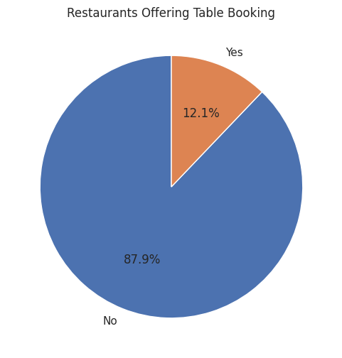
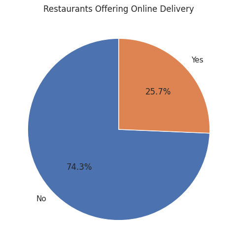
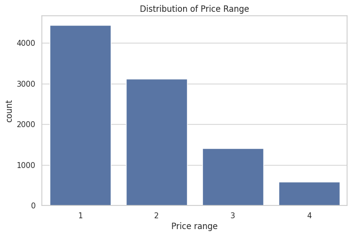
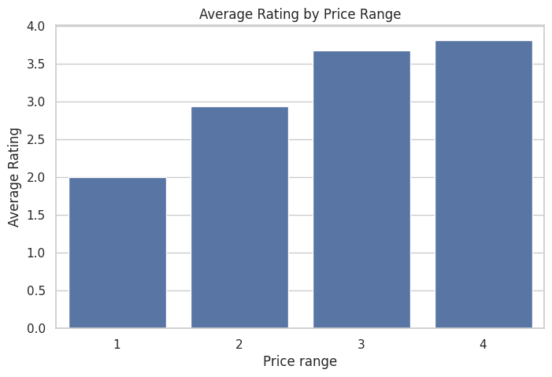

# Level 2 - Business Insights & Feature Engineering


---

# Project Overview

This project represents **Level 2** of the **Cognifyz Technologies Data Science Internship Program**.

Building upon the exploratory analysis performed in Level 1, this stage focuses on extracting meaningful business insights from the restaurant dataset and applying feature engineering techniques to prepare the data for future machine learning applications.

The project investigates customer-oriented business factors such as table booking availability, online delivery services, pricing strategies, and restaurant ratings. It also introduces feature engineering by creating new numerical variables and encoding categorical attributes, making the dataset more suitable for predictive analytics.

Through visualization and statistical analysis, this project demonstrates how business intelligence techniques can transform raw data into actionable insights for decision-making.

---

# Objectives

The primary objectives of this project are to:

- Analyze restaurant table booking availability.
- Analyze online food delivery services.
- Compare customer ratings based on business features.
- Study restaurant pricing strategies.
- Analyze average ratings across different price ranges.
- Identify relationships between price and customer satisfaction.
- Perform feature engineering by creating new variables.
- Convert categorical variables into numerical representations.
- Prepare the dataset for predictive modeling.
- Generate business insights using professional data visualizations.

---

# Dataset Information

This project uses the **Zomato Restaurant Dataset**, which contains comprehensive information about restaurants across multiple cities.

The dataset includes various business-related attributes such as:

- Restaurant Name
- Country Code
- City
- Locality
- Latitude & Longitude
- Cuisines
- Average Cost for Two
- Currency
- Has Table Booking
- Has Online Delivery
- Is Delivering Now
- Price Range
- Aggregate Rating
- Rating Color
- Rating Text
- Votes

The dataset enables business-oriented analysis by examining restaurant services, pricing strategies, customer preferences, and operational characteristics.

---

# Project Structure

```text
DataScience-Level2-BusinessInsights/
│
├── images/
│   ├── Average_Rating_by_Price_Range.png
│   ├── Online_Delivery_Distribution.png
│   ├── Price_Range_Distribution.png
│   └── Table_Booking_Distribution.png
│
├── Dataset.csv
├── Level_2_Business_Insights.ipynb
└── README.md
```

---

### Repository Contents

| File / Folder | Description |
|---------------|-------------|
| `images/` | Contains screenshots of important charts and business analysis visualizations. |
| `Level_2_Business_Insights.ipynb` | Complete notebook containing business insights, feature engineering, and visualization tasks. |
| `Dataset.csv` | Zomato restaurant dataset used for the analysis. |
| `README.md` | Complete project documentation, workflow, business analysis, and project summary. |

---

# Technologies Used

The project was developed using the following technologies:

- Python 3
- Visual Studio Code
- Jupyter Notebook
- Git
- GitHub

---

# Python Libraries Used

| Library | Purpose |
|----------|---------|
| Pandas | Data loading, manipulation, and feature engineering |
| NumPy | Numerical computations |
| Matplotlib | Data visualization |
| Seaborn | Statistical visualization |
| Scikit-learn | Feature encoding and preprocessing techniques |

---

# Development Environment

- **IDE:** Visual Studio Code
- **Notebook Environment:** Jupyter Notebook
- **Programming Language:** Python
- **Version Control:** Git & GitHub

---

# Skills Demonstrated

This project demonstrates practical knowledge of:

- Business Data Analysis
- Feature Engineering
- Data Transformation
- Customer Behaviour Analysis
- Restaurant Service Analysis
- Pricing Strategy Analysis
- Data Visualization
- Exploratory Business Analytics
- Python Programming
- Data Interpretation

---

# Project Workflow

The Level 2 workflow focuses on transforming exploratory analysis into meaningful business intelligence and preparing the dataset for future predictive modeling.

The overall workflow followed in this project is:

```text
Dataset Collection
        │
        ▼
Data Loading
        │
        ▼
Restaurant Service Analysis
        │
        ▼
Price Range Analysis
        │
        ▼
Feature Engineering
        │
        ▼
Business Insights
        │
        ▼
Prepared Dataset for Machine Learning
```

This workflow helps understand how restaurant services and pricing influence customer ratings while preparing the data for advanced analytics.

---

# Step 1 – Data Loading

The restaurant dataset was imported into a Pandas DataFrame and inspected before beginning the analysis.

Initial exploration included:

- Loading the dataset
- Displaying the first and last records
- Verifying successful data import
- Understanding the available business features

This ensured the dataset was ready for further analysis.

---

# Step 2 – Restaurant Service Analysis

Restaurant services play an important role in customer satisfaction and business performance.

This task focuses on analyzing two major services:

- Table Booking
- Online Delivery

### Analysis Performed

- Calculated the percentage of restaurants offering table booking.
- Calculated the percentage of restaurants providing online delivery.
- Compared average customer ratings based on table booking availability.
- Examined online delivery services across different price ranges.
- Visualized the results using pie charts and bar charts.

### Purpose

This analysis helps understand whether additional restaurant services contribute to higher customer satisfaction and improved business performance.

---

# Step 3 – Price Range Analysis

Restaurant pricing is one of the most important business indicators.

The project investigates how pricing relates to customer ratings and market distribution.

### Analysis Performed

- Identified the most common restaurant price range.
- Calculated the average rating for each price category.
- Examined the distribution of restaurants across price ranges.
- Compared rating performance between different pricing segments.
- Analyzed rating colors associated with restaurant ratings.

### Purpose

Understanding pricing trends helps identify customer preferences and market positioning strategies.

---

# Step 4 – Feature Engineering

Feature Engineering prepares raw data for future machine learning applications.

Several new features were created from the existing dataset.

### Feature Engineering Tasks

- Extracted the length of restaurant names.
- Extracted the length of restaurant addresses.
- Encoded **Has Table Booking** into numerical values.
- Encoded **Has Online Delivery** into numerical values.
- Generated summary statistics for the newly created features.

### Purpose

These engineered features improve the dataset by converting business information into machine-learning-friendly numerical variables.

---

# Workflow Summary

The Level 2 workflow successfully completed the following tasks:

- Business Service Analysis
- Table Booking Analysis
- Online Delivery Analysis
- Price Range Analysis
- Customer Rating Analysis
- Rating Color Analysis
- Feature Engineering
- Data Transformation
- Business Insight Generation
- Dataset Preparation for Predictive Modeling

The completion of these tasks provides valuable business insights while creating a stronger foundation for the predictive modeling work performed in **Level 3**.

---

# Business Analysis & Key Insights

After preparing and exploring the dataset, detailed business-oriented analyses were performed to understand restaurant services, pricing strategies, customer preferences, and feature relationships.

The following sections summarize the major findings obtained during this level.

---

# Task 1 – Restaurant Service Analysis

Restaurant services significantly influence customer convenience and overall satisfaction. Two important services were analyzed:

- Table Booking
- Online Delivery

These analyses help understand how restaurants differentiate themselves and improve customer experience.

## Table Booking Analysis

The availability of table booking services was examined to understand how many restaurants provide reservation facilities.

### Analysis Performed

- Calculated the percentage of restaurants offering table booking.
- Compared restaurants with and without booking facilities.
- Visualized the distribution using a pie chart.
- Compared customer ratings based on booking availability.

### Key Findings

- Only a smaller proportion of restaurants provide table booking facilities.
- Restaurants offering table booking generally receive higher average customer ratings.
- Reservation services appear to enhance customer satisfaction and overall dining experience.

---

## Online Delivery Analysis

Online food delivery has become an essential service for modern restaurants.

### Analysis Performed

- Calculated the percentage of restaurants offering online delivery.
- Compared restaurants providing delivery services with those that do not.
- Analyzed delivery availability across different price ranges.
- Visualized the distribution using charts.

### Key Findings

- Online delivery services are available for a significant number of restaurants.
- Delivery availability varies across different pricing categories.
- Restaurants supporting online delivery tend to attract a wider customer base and improve service accessibility.

---

# Task 2 – Price Range Analysis

Pricing is one of the strongest indicators of restaurant positioning within the market.

This analysis investigates how restaurant pricing relates to customer ratings and business performance.

## Analysis Performed

- Examined restaurant distribution across different price ranges.
- Identified the most common pricing category.
- Calculated average customer ratings for each price range.
- Compared rating performance among pricing segments.
- Visualized the relationship using bar charts.

## Key Findings

- Most restaurants belong to affordable and mid-range price categories.
- Higher price ranges generally exhibit better customer ratings.
- Premium restaurants represent a smaller portion of the dataset but often achieve stronger customer satisfaction.

---

# Task 3 – Feature Engineering

Feature engineering transforms raw business information into numerical variables suitable for machine learning.

Several new features were generated from existing restaurant information.

## Features Created

- Restaurant Name Length
- Address Length
- Numerical encoding for **Has Table Booking**
- Numerical encoding for **Has Online Delivery**

These engineered features enrich the dataset while improving compatibility with predictive models.

## Benefits

- Better feature representation
- Improved machine learning readiness
- Easier numerical analysis
- Enhanced predictive capability

---

# Business Applications

The insights generated in this project can support several real-world business decisions.

Examples include:

- Improving customer service strategies.
- Optimizing online delivery operations.
- Enhancing restaurant reservation systems.
- Designing better pricing strategies.
- Supporting market segmentation.
- Assisting restaurant owners in identifying customer preferences.
- Providing high-quality features for future predictive modeling.

---

# Key Business Insights

The overall analysis reveals several important observations:

- Restaurants with table booking facilities generally achieve higher customer ratings.
- Online delivery plays an important role in improving customer convenience.
- Affordable restaurants dominate the market, while premium restaurants typically receive stronger ratings.
- Feature engineering successfully transforms categorical business data into machine-learning-friendly variables.
- Business analytics provides valuable support for strategic decision-making in the restaurant industry.

---

# Summary of Level 2

During this level, the following objectives were successfully completed:

- Restaurant Service Analysis
- Table Booking Analysis
- Online Delivery Analysis
- Price Range Analysis
- Customer Rating Analysis
- Feature Engineering
- Business Insight Generation
- Data Transformation
- Machine Learning Data Preparation

---

# Project Screenshots

The following visualizations highlight the key analyses performed during Level 2.

---

## Table Booking Distribution

This chart illustrates the proportion of restaurants that offer table booking facilities.

<p align="center">
  
</p>

**Insight:**  
The visualization provides a clear comparison between restaurants with and without table booking services, helping evaluate the adoption of reservation facilities.

---

## Online Delivery Distribution

This visualization shows the percentage of restaurants that provide online food delivery services.

<p align="center">
  
</p>

**Insight:**  
Online delivery has become an important business feature, allowing restaurants to reach a broader customer base and improve service accessibility.

---

## Price Range Distribution

This chart presents the distribution of restaurants across different pricing categories.

<p align="center">
  
</p>

**Insight:**  
Most restaurants are concentrated in affordable and mid-range pricing categories, indicating strong competition in these market segments.

---

## Average Rating by Price Range

This visualization compares the average customer ratings across different restaurant price ranges.

<p align="center">
  
</p>

**Insight:**  
The comparison helps identify how pricing strategies relate to customer satisfaction and perceived restaurant quality.

---

---

# How to Run the Project

Follow these steps to execute this project on your local machine.

## 1. Clone the Repository

```bash
git clone https://github.com/your-username/Cognifyz-DataScience-Projects.git
```

## 2. Navigate to the Project Folder

```bash
cd Cognifyz-DataScience-Projects/DataScience-Level2-BusinessInsights
```

## 3. Install Required Libraries

```bash
pip install pandas numpy matplotlib seaborn scikit-learn jupyter
```

## 4. Launch Jupyter Notebook

```bash
jupyter notebook
```

Open:

```
Level_2_Business_Insights.ipynb
```

Run all cells sequentially to reproduce the complete business analysis and feature engineering workflow.

---

# Project Outcomes

The successful completion of this project resulted in:

- Comprehensive analysis of restaurant business services.
- Evaluation of table booking and online delivery availability.
- Comparison of customer ratings across different business features.
- Analysis of restaurant pricing strategies.
- Creation of engineered numerical features.
- Preparation of the dataset for machine learning applications.
- Generation of actionable business insights through visualization and statistical analysis.

---

# Learning Outcomes

This project strengthened practical knowledge in:

- Business Data Analytics
- Feature Engineering
- Customer Behaviour Analysis
- Restaurant Service Analysis
- Pricing Strategy Evaluation
- Data Transformation
- Feature Encoding
- Data Visualization
- Python Programming
- Preparing Real-world Data for Machine Learning

---

# Future Improvements

The project can be extended in several ways:

- Develop predictive models using the engineered features.
- Build interactive dashboards using Power BI or Tableau.
- Apply clustering techniques for restaurant segmentation.
- Perform customer recommendation analysis.
- Incorporate customer review sentiment analysis.
- Deploy the analysis as an interactive web application.

---

# Author

**Anirban Garai**

---

# License

This project is licensed under the **MIT License**.

You are free to use, modify, and distribute this project for educational and learning purposes.

---

# Acknowledgements

This project was completed as part of the **Data Science Internship Program** offered by **Cognifyz Technologies**.

I sincerely thank the Cognifyz Technologies team for providing a structured, project-based learning experience that strengthened my practical skills in business analytics, feature engineering, and data-driven decision-making.

---

# Support the Project

If you found this project useful or insightful, consider giving this repository a ⭐ on GitHub.

Your support motivates continuous learning and the development of more real-world data science projects.
