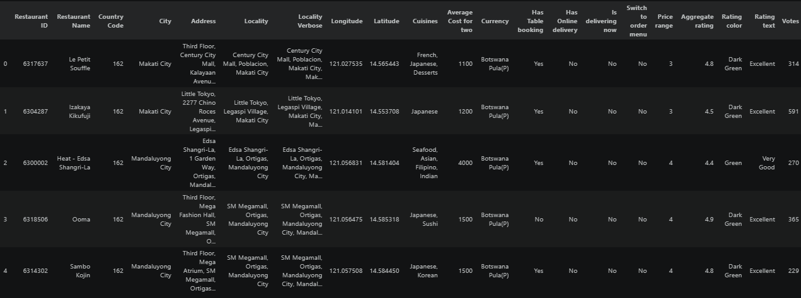
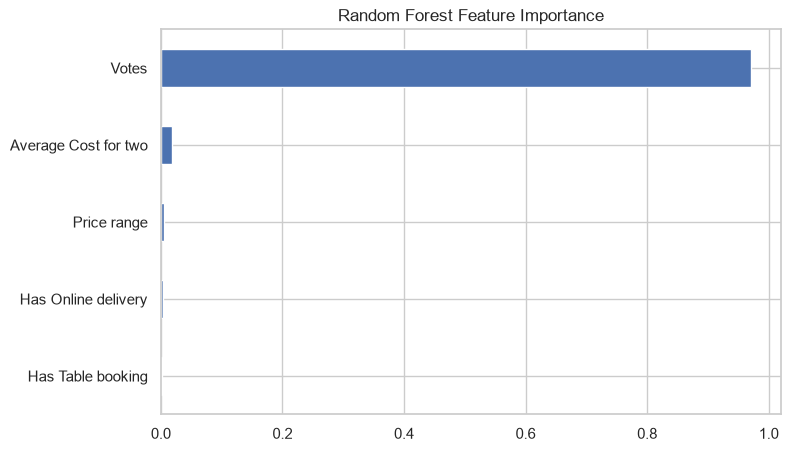
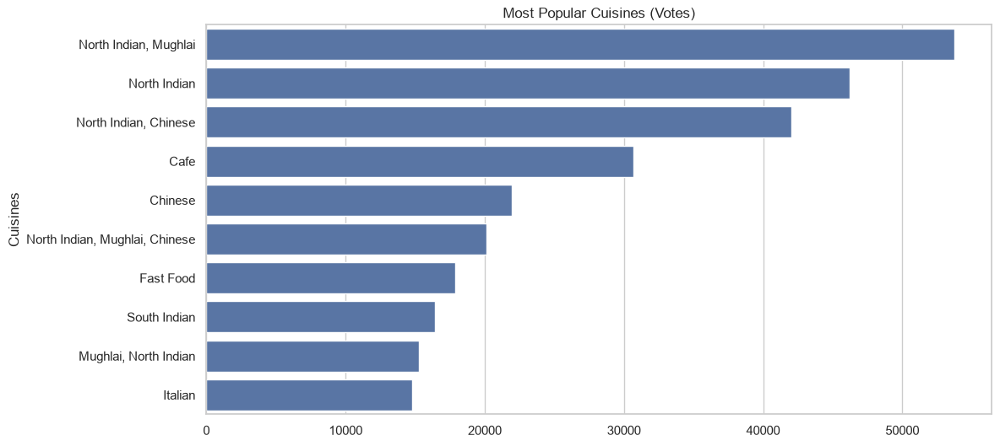
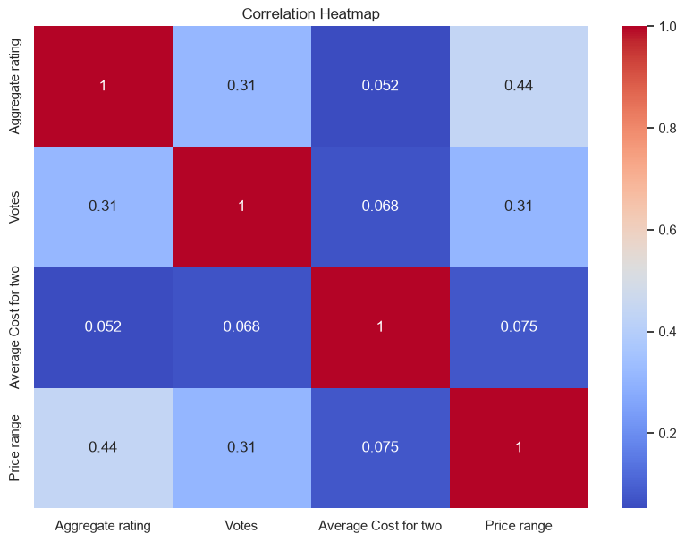

# Level 3 - Predictive Modeling & Machine Learning


---

# Project Overview

This project represents **Level 3** of the **Cognifyz Technologies Data Science Internship Program**.

The primary focus of this level is to apply **Machine Learning** techniques for predictive modeling using the restaurant dataset. Building upon the exploratory analysis performed in Level 1 and the business insights generated in Level 2, this stage transforms the processed dataset into predictive models capable of estimating restaurant ratings.

Multiple regression algorithms were implemented and evaluated to compare their predictive performance. Feature engineering, model evaluation, feature importance analysis, cuisine-based insights, and correlation analysis were also performed to better understand the factors influencing restaurant ratings.

This project demonstrates the complete machine learning workflow, from data preparation to model comparison and interpretation, while emphasizing practical applications in restaurant analytics and business intelligence.

---

# Objectives

The primary objectives of this project are to:

- Build regression models to predict restaurant aggregate ratings.
- Compare the performance of multiple machine learning algorithms.
- Evaluate predictive models using appropriate regression metrics.
- Identify the most influential features affecting restaurant ratings.
- Analyze popular cuisines based on customer ratings.
- Explore correlations among important numerical variables.
- Interpret model performance and business implications.
- Demonstrate practical applications of predictive analytics.
- Prepare a complete end-to-end machine learning workflow.
- Develop a reproducible and well-documented predictive modeling project.

---

# Dataset Information

This project utilizes the **Zomato Restaurant Dataset**, which contains detailed information about restaurants, customer ratings, cuisines, pricing, and operational services.

The dataset includes several important attributes, such as:

- Restaurant Name
- Country Code
- City
- Locality
- Latitude & Longitude
- Cuisines
- Average Cost for Two
- Currency
- Has Table Booking
- Has Online Delivery
- Is Delivering Now
- Price Range
- Aggregate Rating
- Rating Color
- Rating Text
- Votes

For this level, the dataset serves as the foundation for building regression models that predict restaurant ratings and identify the most influential business factors.

---

# Project Structure

```text
DataScience-Level3-PredictiveModeling/
│
├── images/
│   ├── Correlation_Heatmap.png
│   ├── Dataset_Preview.png
│   ├── Feature_Importance.png
│   ├── Model_Comparison.png
│   ├── Most_Popular_Cuisines.png
│
├── Dataset.csv
├── Level_3_Machine_Learning.ipynb
└── README.md
```

---

### Repository Contents

| File / Folder | Description |
|---------------|-------------|
| `images/` | Screenshots of machine learning outputs, feature importance, correlation analysis, and visualizations. |
| `Level_3_Machine_Learning.ipynb` | Complete notebook implementing predictive modeling, model evaluation, feature importance analysis, cuisine analysis, and correlation analysis. |
| `Dataset.csv` | Restaurant dataset used for machine learning and predictive analytics. |
| `README.md` | Comprehensive project documentation including workflow, methodology, results, and conclusions. |

---

# Technologies Used

The project was developed using:

- Python 3
- Visual Studio Code
- Jupyter Notebook
- Git
- GitHub

---

# Python Libraries Used

| Library | Purpose |
|----------|---------|
| Pandas | Data loading, cleaning, and manipulation |
| NumPy | Numerical computations |
| Matplotlib | Data visualization |
| Seaborn | Statistical visualization |
| Scikit-learn | Machine learning model development and evaluation |

---

# Development Environment

- **IDE:** Visual Studio Code
- **Notebook Environment:** Jupyter Notebook
- **Programming Language:** Python
- **Machine Learning Library:** Scikit-learn
- **Version Control:** Git & GitHub

---

# Skills Demonstrated

This project demonstrates practical knowledge of:

- Predictive Modeling
- Machine Learning
- Regression Analysis
- Model Evaluation
- Feature Engineering
- Feature Importance Analysis
- Correlation Analysis
- Data Visualization
- Business Analytics
- Python Programming
- Data Interpretation

---

# Project Workflow

The Level 3 workflow focuses on building, evaluating, and interpreting machine learning models to predict restaurant aggregate ratings. The workflow integrates data preprocessing, feature engineering, regression modeling, performance evaluation, and model interpretation.

The complete workflow followed in this project is:

```text
Dataset Collection
        │
        ▼
Data Loading
        │
        ▼
Data Preprocessing
        │
        ▼
Feature Engineering
        │
        ▼
Feature Selection
        │
        ▼
Train-Test Split
        │
        ▼
Model Training
        │
        ▼
Model Evaluation
        │
        ▼
Model Comparison
        │
        ▼
Feature Importance Analysis
        │
        ▼
Business Insights
```

This workflow demonstrates a complete end-to-end predictive analytics pipeline commonly used in real-world machine learning projects.

---

# Step 1 – Data Loading

The restaurant dataset was imported into a Pandas DataFrame and inspected before model development.

Initial exploration included:

- Loading the dataset into memory.
- Displaying sample records.
- Understanding feature availability.
- Verifying successful data import.
- Examining the overall dataset structure.

This ensures that the dataset is correctly prepared before preprocessing begins.

---

# Step 2 – Data Preprocessing

Before training machine learning models, the dataset was cleaned and transformed into a suitable format.

### Preprocessing Activities

- Selected relevant predictive features.
- Handled categorical variables using appropriate encoding techniques.
- Prepared numerical features.
- Removed unnecessary information not required for prediction.
- Constructed the final feature matrix for model training.

### Purpose

Proper preprocessing improves model quality and ensures compatibility with machine learning algorithms.

---

# Step 3 – Predictive Modeling

The prepared dataset was divided into training and testing datasets before building predictive models.

Multiple regression algorithms were implemented and compared to identify the most effective model for predicting restaurant aggregate ratings.

### Models Evaluated

- Linear Regression
- Decision Tree Regressor
- Random Forest Regressor

Each model was trained using the same dataset to enable a fair comparison of predictive performance.

---

# Step 4 – Model Evaluation

Each regression model was evaluated using standard machine learning performance metrics.

### Evaluation Criteria

- R² Score
- Model comparison
- Prediction accuracy
- Generalization performance

The comparison helps determine which algorithm provides the most reliable predictions for restaurant ratings.

---

# Step 5 – Feature Importance Analysis

Feature importance analysis was performed using the best-performing tree-based model.

### Analysis Performed

- Calculated feature importance scores.
- Ranked input variables based on their contribution.
- Visualized feature importance using a bar chart.

### Purpose

Understanding feature importance improves model interpretability and helps identify the business factors that most strongly influence restaurant ratings.

---

# Step 6 – Cuisine Analysis

Cuisine information was analyzed to identify the highest-rated and most popular cuisine categories.

### Analysis Performed

- Compared cuisine ratings.
- Identified highly rated cuisine types.
- Visualized cuisine performance.

### Purpose

Cuisine analysis provides additional business insights that complement the predictive modeling results.

---

# Step 7 – Correlation Analysis

Correlation analysis was conducted to examine relationships among important numerical variables.

### Analysis Performed

- Generated a correlation matrix.
- Visualized correlations using a heatmap.
- Identified positive and negative relationships between features.

### Purpose

Correlation analysis helps understand feature relationships and supports future feature selection for machine learning models.

---

# Workflow Summary

The Level 3 workflow successfully completed the following tasks:

- Data Preprocessing
- Feature Engineering
- Regression Model Development
- Model Evaluation
- Algorithm Comparison
- Feature Importance Analysis
- Cuisine Analysis
- Correlation Analysis
- Machine Learning Interpretation
- Predictive Business Insight Generation

The successful completion of these tasks demonstrates a complete machine learning pipeline, from raw data preparation to predictive modeling and interpretation, providing valuable insights for restaurant analytics.

---

# Machine Learning Analysis & Results

After preparing the dataset and building multiple regression models, detailed analyses were performed to evaluate predictive performance, identify influential features, and generate meaningful business insights.

The following sections summarize the major findings of Level 3.

---

# Task 1 – Predictive Modeling

The primary objective of this task was to develop regression models capable of predicting restaurant aggregate ratings based on available business features.

Multiple machine learning algorithms were implemented and evaluated to determine the most effective predictive model.

## Models Implemented

- Linear Regression
- Decision Tree Regressor
- Random Forest Regressor

Each model was trained using the same dataset and evaluated using identical performance metrics to ensure a fair comparison.

---

## Model Performance Evaluation

Several regression evaluation techniques were used to compare model performance.

### Evaluation Metrics

- R² Score
- Prediction Accuracy
- Model Generalization
- Comparative Performance Analysis

The comparison identifies the model that best captures the relationship between restaurant characteristics and customer ratings.

---

## Feature Importance Analysis

After identifying the best-performing model, feature importance analysis was conducted.

### Analysis Performed

- Ranked input variables according to their predictive contribution.
- Visualized feature importance using a bar chart.
- Identified the strongest predictors of restaurant ratings.

### Key Findings

- Some restaurant attributes contribute significantly more than others.
- Feature importance improves model interpretability.
- Understanding influential variables helps support better business decision-making.

---

# Task 2 – Cuisine Analysis

Cuisine type plays an important role in customer satisfaction and restaurant popularity.

This task analyzes cuisine categories to identify the highest-performing cuisine types.

## Analysis Performed

- Compared cuisine categories.
- Calculated average ratings for cuisines.
- Identified top-rated cuisines.
- Visualized cuisine performance.

### Key Findings

- Certain cuisines consistently achieve higher customer ratings.
- Cuisine popularity reflects customer preferences and regional demand.
- Restaurant owners can use these insights when planning menu offerings.

---

# Task 3 – Correlation Analysis

Correlation analysis was performed to understand relationships among important numerical variables.

## Analysis Performed

- Generated a correlation matrix.
- Visualized correlations using a heatmap.
- Identified positive and negative feature relationships.

### Key Findings

- Some numerical variables exhibit strong positive correlations.
- Other variables show weak or minimal relationships.
- Correlation analysis supports feature selection for future predictive models.

---

# Practical Applications

The predictive modeling pipeline developed in this project can support several real-world business applications.

Examples include:

- Restaurant rating prediction.
- Customer satisfaction forecasting.
- Business decision support.
- Restaurant performance evaluation.
- Pricing strategy optimization.
- Customer experience improvement.
- Feature selection for future machine learning projects.

---

# Machine Learning Insights

The overall machine learning analysis highlights several important observations:

- Multiple regression algorithms were successfully implemented and evaluated.
- Model comparison identified the most effective predictive approach.
- Feature importance analysis improved model interpretability.
- Cuisine analysis revealed meaningful customer preference patterns.
- Correlation analysis strengthened the understanding of feature relationships.
- Predictive analytics provides valuable support for restaurant business intelligence and data-driven decision-making.

---

# Summary of Level 3

During this level, the following objectives were successfully completed:

- Predictive Modeling
- Regression Analysis
- Model Comparison
- Model Evaluation
- Feature Importance Analysis
- Cuisine Analysis
- Correlation Analysis
- Machine Learning Interpretation
- Predictive Business Analytics
- End-to-End Machine Learning Workflow

---

# Project Screenshots

The following visualizations represent the key analyses and machine learning outputs generated during Level 3.

---

## Dataset Preview

The dataset preview provides an overview of the restaurant information used for predictive modeling and machine learning.

<p align="center">
  
</p>

---

## Model Performance Comparison

This visualization compares the performance of different regression algorithms used to predict restaurant aggregate ratings.

<p align="center">
  
</p>

**Insight:**

The comparison helps identify the regression model that delivers the best predictive performance, providing a reliable basis for restaurant rating prediction.

---

## Feature Importance Analysis

Feature importance analysis highlights the variables that contribute the most to predicting restaurant ratings.

<p align="center">
  
</p>

**Insight:**

Understanding feature importance improves model interpretability and helps identify the business factors that have the greatest influence on customer ratings.

---

## Most Popular Cuisines

This visualization presents the highest-rated and most popular cuisine categories within the dataset.

<p align="center">
  
</p>

**Insight:**

Cuisine analysis provides valuable information about customer preferences and helps restaurants understand which cuisine categories receive stronger customer appreciation.

---

## Correlation Heatmap

The correlation heatmap illustrates relationships among important numerical variables used in predictive modeling.

<p align="center">
  
</p>

**Insight:**

Correlation analysis helps identify positive and negative relationships between variables, supporting feature selection and improving the effectiveness of machine learning models.

---
---

# How to Run the Project

Follow these steps to execute this project on your local machine.

## 1. Clone the Repository

```bash
git clone https://github.com/your-username/Cognifyz-DataScience-Projects.git
```

## 2. Navigate to the Project Folder

```bash
cd Cognifyz-DataScience-Projects/DataScience-Level3-PredictiveModeling
```

## 3. Install Required Libraries

```bash
pip install pandas numpy matplotlib seaborn scikit-learn jupyter
```

## 4. Launch Jupyter Notebook

```bash
jupyter notebook
```

Open:

```
Level_3_Machine_Learning.ipynb
```

Run all notebook cells sequentially to reproduce the complete machine learning workflow, predictive models, visualizations, and evaluation results.

---

# Project Outcomes

The successful completion of this project resulted in:

- Development of multiple regression models for restaurant rating prediction.
- Comparative evaluation of different machine learning algorithms.
- Identification of the best-performing predictive model.
- Analysis of feature importance for model interpretability.
- Exploration of cuisine popularity and customer preferences.
- Correlation analysis among important numerical variables.
- Generation of predictive business insights using machine learning.
- Development of a complete end-to-end predictive analytics workflow.

---

# Learning Outcomes

This project strengthened practical knowledge in:

- Machine Learning
- Regression Analysis
- Predictive Modeling
- Model Evaluation
- Feature Engineering
- Feature Importance Analysis
- Correlation Analysis
- Data Visualization
- Business Intelligence
- Python Programming
- Data Interpretation
- End-to-End Machine Learning Workflow

---

# Future Improvements

The project can be enhanced further by:

- Performing hyperparameter tuning for improved model performance.
- Exploring advanced ensemble learning techniques.
- Applying gradient boosting algorithms such as XGBoost or LightGBM.
- Building a restaurant recommendation system.
- Deploying the trained model as a web application using Flask or Streamlit.
- Creating interactive dashboards for real-time prediction and business analytics.

---

# Author

**Anirban Garai**

---

# License

This project is licensed under the **MIT License**.

You are free to use, modify, and distribute this project for educational and learning purposes.

---

# Acknowledgements

This project was completed as part of the **Data Science Internship Program** offered by **Cognifyz Technologies**.

I sincerely thank **Cognifyz Technologies** for providing a structured, hands-on learning experience that enabled me to apply machine learning concepts, predictive analytics, and business intelligence techniques to real-world datasets.

---

# Support the Project

If you found this project helpful or interesting, consider giving this repository a ⭐ on GitHub.

Your support encourages continued learning, project development, and contributions to the data science community.
