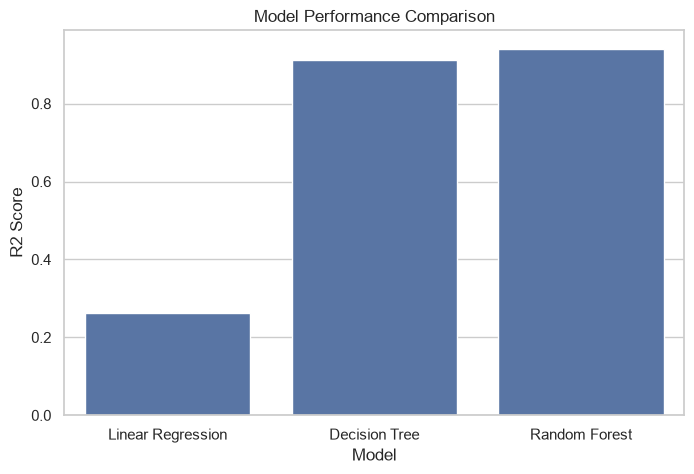

# Cognifyz Data Science Internship Projects (CDSIP)


---

# Repository Overview

Welcome to my **Cognifyz Data Science Internship Projects (CDSIP)** repository.

This repository contains all projects successfully completed during the **Data Science Internship Program** offered by **Cognifyz Technologies**.

Throughout this internship, I completed multiple real-world data science tasks covering the complete analytics pipeline—from **Exploratory Data Analysis (EDA)** and **Business Analytics** to **Feature Engineering**, **Machine Learning**, and **Predictive Modeling**.

Each project has been organized into separate levels, with dedicated documentation, datasets, notebooks, visualizations, and implementation details to ensure clarity, reproducibility, and ease of understanding.

The repository demonstrates practical applications of Python-based data science techniques using industry-standard libraries such as **Pandas**, **NumPy**, **Matplotlib**, **Seaborn**, and **Scikit-learn**.

---

# Repository Objectives

This repository was created to:

- Demonstrate practical data science skills through project-based learning.
- Perform exploratory data analysis on real-world datasets.
- Generate meaningful business insights through visualization and statistical analysis.
- Apply feature engineering techniques for data preprocessing.
- Develop and evaluate machine learning models.
- Compare multiple predictive algorithms.
- Document the complete workflow for each project.
- Build a professional GitHub portfolio showcasing practical data science work.

---

# Overview

- **Level 1:** Exploratory Data Analysis (EDA)
- **Level 2:** Business Insights & Feature Engineering
- **Level 3:** Predictive Modeling & Machine Learning

---

# Repository Structure

```text
CDSIP/
│
├── DataScience-Level1-DataExploration/
│   ├── images/
│   ├── Dataset.csv
│   ├── Level_1_Data_Exploration.ipynb
│   └── README.md
│
├── DataScience-Level2-BusinessInsights/
│   ├── images/
│   ├── Dataset.csv
│   ├── Level_2_Business_Insights.ipynb
│   └── README.md
│
├── DataScience-Level3-PredictiveModeling/
│   ├── images/
│   ├── Dataset.csv
│   ├── Level_3_Machine_Learning.ipynb
│   └── README.md
│
├── LICENSE
├── .gitignore
└── README.md
```

---

# Repository Contents

| Folder | Description |
|---------|-------------|
| `DataScience-Level1-DataExploration` | Exploratory Data Analysis (EDA), descriptive statistics, data preprocessing, and geospatial analysis. |
| `DataScience-Level2-BusinessInsights` | Business analytics, restaurant service analysis, feature engineering, and pricing insights. |
| `DataScience-Level3-PredictiveModeling` | Machine learning, predictive modeling, regression analysis, feature importance, and correlation analysis. |

---

# Technologies Used

The projects in this repository were developed using:

- Python 3
- Visual Studio Code
- Jupyter Notebook
- Git
- GitHub

---

# Python Libraries

The following Python libraries were used throughout the internship projects:

| Library | Purpose |
|----------|---------|
| Pandas | Data loading, manipulation, and preprocessing |
| NumPy | Numerical computing |
| Matplotlib | Data visualization |
| Seaborn | Statistical visualization |
| Scikit-learn | Machine learning, regression models, preprocessing, and model evaluation |

---

# Development Environment

- **Programming Language:** Python
- **IDE:** Visual Studio Code
- **Notebook Environment:** Jupyter Notebook
- **Version Control:** Git & GitHub

---

# Core Skills Demonstrated

The projects collectively demonstrate practical experience in:

- Exploratory Data Analysis (EDA)
- Data Cleaning & Preprocessing
- Descriptive Statistics
- Business Intelligence
- Feature Engineering
- Data Visualization
- Geospatial Analysis
- Predictive Modeling
- Regression Analysis
- Machine Learning
- Model Evaluation
- Business Insight Generation

---

# Level 1 – Data Exploration & Exploratory Data Analysis (EDA)

**Folder:** `DataScience-Level1-DataExploration`

Level 1 focuses on understanding the restaurant dataset through Exploratory Data Analysis (EDA). The objective is to examine the dataset structure, identify patterns, perform descriptive statistics, and generate meaningful business insights using visualizations.

### Major Tasks

- Data Exploration & Preprocessing
- Descriptive Statistical Analysis
- Aggregate Rating Analysis
- Cuisine Analysis
- City-wise Restaurant Analysis
- Price Range Analysis
- Geospatial Analysis
- Business Insight Generation

### Skills Developed

- Data Cleaning
- Exploratory Data Analysis
- Statistical Analysis
- Data Visualization
- Geospatial Analytics
- Business Interpretation

### Technologies Used

- Pandas
- NumPy
- Matplotlib
- Seaborn

**Documentation:** `DataScience-Level1-DataExploration/README.md`

---

# Level 2 – Business Insights & Feature Engineering

**Folder:** `DataScience-Level2-BusinessInsights`

Level 2 extends the exploratory analysis by focusing on business intelligence and feature engineering. This project investigates restaurant services, pricing strategies, customer preferences, and prepares the dataset for predictive analytics.

### Major Tasks

- Restaurant Service Analysis
- Table Booking Analysis
- Online Delivery Analysis
- Price Range Analysis
- Feature Engineering
- Customer Rating Analysis
- Business Insight Generation

### Skills Developed

- Business Analytics
- Feature Engineering
- Customer Behaviour Analysis
- Data Transformation
- Business Visualization
- Data Preparation

### Technologies Used

- Pandas
- NumPy
- Matplotlib
- Seaborn
- Scikit-learn

**Documentation:** `DataScience-Level2-BusinessInsights/README.md`

---

# Level 3 – Predictive Modeling & Machine Learning

**Folder:** `DataScience-Level3-PredictiveModeling`

Level 3 focuses on building predictive machine learning models to estimate restaurant ratings. Multiple regression algorithms are compared, evaluated, and interpreted using feature importance and correlation analysis.

### Major Tasks

- Predictive Modeling
- Regression Analysis
- Model Evaluation
- Model Comparison
- Feature Importance Analysis
- Cuisine Analysis
- Correlation Analysis

### Skills Developed

- Machine Learning
- Regression Modeling
- Predictive Analytics
- Model Evaluation
- Feature Importance
- Correlation Analysis

### Technologies Used

- Pandas
- NumPy
- Matplotlib
- Seaborn
- Scikit-learn

**Documentation:** `DataScience-Level3-PredictiveModeling/README.md`

---

# Repository Highlights

Across these three levels, this repository demonstrates:

- 📊 Exploratory Data Analysis (EDA)
- 📈 Statistical Analysis
- 💼 Business Intelligence
- ⚙️ Feature Engineering
- 🤖 Machine Learning
- 📉 Regression Modeling
- 🌍 Geospatial Analysis
- 🔥 Correlation Analysis
- 🌲 Feature Importance Analysis
- 📊 Professional Data Visualization
- 📚 Well-Documented Projects
- 💻 Reproducible Jupyter Notebooks

---

# Data Science Workflow

The projects collectively follow a structured end-to-end data science workflow:

```text
Problem Understanding
          │
          ▼
Dataset Collection
          │
          ▼
Data Cleaning & Preprocessing
          │
          ▼
Exploratory Data Analysis (EDA)
          │
          ▼
Business Insights
          │
          ▼
Feature Engineering
          │
          ▼
Machine Learning
          │
          ▼
Model Evaluation
          │
          ▼
Business Interpretation
```

This workflow reflects the standard lifecycle followed in practical data science projects, from understanding raw data to generating predictive insights.

---

# Key Features

This repository showcases a wide range of practical data science concepts and techniques, including:

- 📊 Exploratory Data Analysis (EDA)
- 📈 Descriptive Statistics
- 🧹 Data Cleaning & Preprocessing
- 🌍 Geospatial Analysis
- 🍽️ Restaurant Business Analytics
- 💰 Pricing Strategy Analysis
- 🚚 Online Delivery & Table Booking Analysis
- ⚙️ Feature Engineering
- 🤖 Machine Learning with Regression Models
- 📉 Model Performance Comparison
- 🌲 Feature Importance Analysis
- 🔥 Correlation Analysis
- 📊 Professional Data Visualization
- 📚 Comprehensive Project Documentation
- 💻 Reproducible Jupyter Notebooks

---

# Project Gallery

Below are sample outputs from each internship level.

## Level 1 – Data Exploration

<p align="center">
  
</p>

**Highlights**

- Exploratory Data Analysis
- Rating Distribution
- Restaurant Statistics
- Business Insights

---

## Level 2 – Business Insights

<p align="center">
  
</p>

**Highlights**

- Restaurant Service Analysis
- Price Range Analysis
- Feature Engineering
- Customer Behaviour Analysis

---

## Level 3 – Predictive Modeling

<p align="center">
  
</p>

**Highlights**

- Machine Learning
- Model Comparison
- Regression Analysis
- Predictive Analytics

---

# Why This Repository?

This repository demonstrates a complete learning journey through the project journey.

Rather than focusing on a single notebook, it presents a structured collection of interconnected projects that progress from data exploration to business analytics and finally to predictive machine learning.

Key strengths include:

- Well-organized project structure
- Detailed documentation for every level
- High-quality visualizations
- Practical machine learning implementation
- Real-world business analysis
- Reproducible workflows
- Portfolio-ready GitHub presentation

---

# What You'll Learn

By exploring this repository, you can understand how to:

- Load and preprocess real-world datasets.
- Perform exploratory data analysis.
- Generate business insights from structured data.
- Engineer features for machine learning.
- Build and evaluate regression models.
- Interpret feature importance.
- Visualize complex relationships using charts and heatmaps.
- Organize professional data science projects on GitHub.

---

---

# Getting Started

Follow these steps to run the projects on your local machine.

## 1. Clone the Repository

```bash
git clone https://github.com/your-username/CDSIP.git
```

Replace **your-username** with your GitHub username.

---

## 2. Navigate to the Repository

```bash
cd CDSIP
```

---

## 3. Install Required Libraries

```bash
pip install pandas numpy matplotlib seaborn scikit-learn jupyter
```

---

## 4. Launch Jupyter Notebook

```bash
jupyter notebook
```

Open any notebook from the desired level:

- `Level_1_Data_Exploration.ipynb`
- `Level_2_Business_Insights.ipynb`
- `Level_3_Machine_Learning.ipynb`

Run all notebook cells sequentially to reproduce the complete analysis and machine learning workflow.

---

# Repository Statistics

| Category | Details |
|-----------|---------|
| Internship Levels | 3 |
| Jupyter Notebooks | 3 |
| Datasets | 3 |
| README Files | 4 |
| Machine Learning Models | Multiple |
| Data Visualizations | 15+ |
| Business Analysis Tasks | Multiple |
| Programming Language | Python |

---

# Skills Acquired

The internship strengthened practical experience in:

- Exploratory Data Analysis (EDA)
- Data Cleaning & Preprocessing
- Business Analytics
- Statistical Analysis
- Feature Engineering
- Machine Learning
- Regression Modeling
- Model Evaluation
- Feature Importance Analysis
- Correlation Analysis
- Data Visualization
- Business Intelligence
- Python Programming
- Git & GitHub
- Technical Documentation

---

# Future Improvements

Possible future enhancements include:

- Add classification-based machine learning projects.
- Explore advanced ensemble algorithms such as XGBoost and LightGBM.
- Build interactive dashboards using Power BI or Tableau.
- Deploy predictive models using Streamlit or Flask.
- Integrate SQL-based data analysis workflows.
- Expand the repository with additional real-world datasets and projects.

---

# Author

## Anirban Garai


### Connect with me

- GitHub: https://github.com/anirbangarai
- LinkedIn: https://www.linkedin.com/in/anirbangarai03

---

# License

This repository is licensed under the **MIT License**.

Feel free to use these projects for educational and learning purposes.

---

# Acknowledgements

I would like to sincerely thank **Cognifyz Technologies** for providing a structured, project-based internship experience that strengthened my practical understanding of data science, business analytics, and machine learning.

The internship offered valuable opportunities to work on real-world datasets, improve problem-solving skills, and develop professional project documentation.

---

# Support

If you found this repository useful or informative, please consider giving it a ⭐ on GitHub.

Your support encourages continuous learning and motivates the development of more practical data science projects.

---

## Thank You for Visiting!

Thank you for exploring this repository.

I hope these projects provide useful insights into data science workflows, business analytics, and machine learning applications. Feedback, suggestions, and constructive discussions are always welcome.
